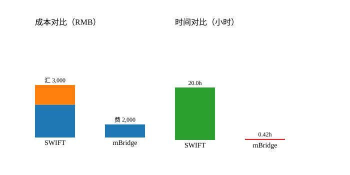

# SWIFT 与 mBridge 跨境支付效率对比

场景：为泰国企业 B 支付 100 万人民币货款，分别通过传统 SWIFT 流程与 mBridge 数字货币跨境桥完成。

## 假设
- 手续费按汇款本金比例一次性计提，不再层层递减。
- SWIFT 路径需人民币→美元→泰铢，造成 0.3% 汇率损失；mBridge 通过平台直接兑换泰铢，忽略额外汇损。
- 时间为业务累计时间（SWIFT 以小时计，mBridge 以分钟计）。

## 计算结果
| 指标 | SWIFT | mBridge |
| --- | --- | --- |
| 总手续费 | 5,000 RMB | 2,000 RMB |
| 汇率损失 | 3,000 RMB | 0 RMB |
| 总成本 | **8,000 RMB** | **2,000 RMB** |
| 总耗时 | **20.0 小时** | **25 分钟（≈0.42 小时）** |
| 最终到账金额（人民币等值） | 992,000 RMB | 998,000 RMB |

## 节省效果
- 成本节省：6,000 RMB（手续费 + 汇率损失）。
- 时间节省：约 19.6 小时。
- 汇率损失节省：3,000 RMB。

## 可视化
- **成本对比**：蓝色为手续费，橙色为汇率损失。
- **时间对比**：以小时为单位直观展示 20 小时 vs. 0.42 小时。

## 复现方法
1. 运行 `python analysis.py` 输出明细与可视化。生成文件：`outputs/comparison.svg`。
2. 如需调整参数，可修改 `analysis.py` 中的手续费、耗时与汇损假设后重跑。
